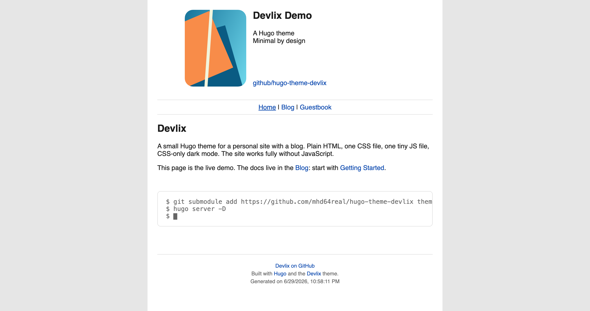
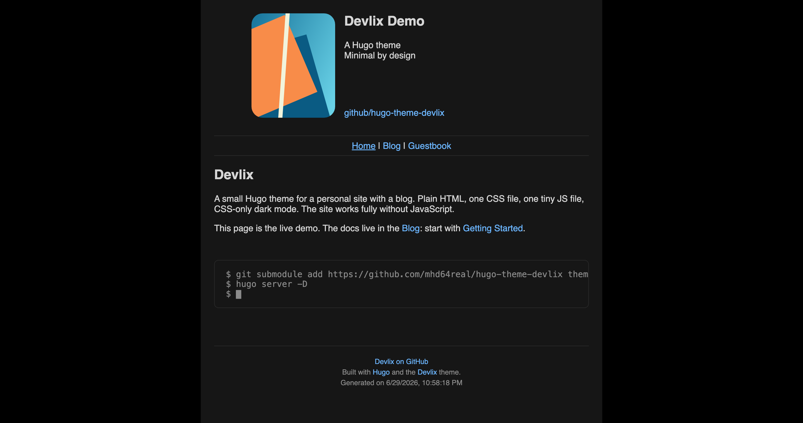

# Devlix

A small [Hugo](https://gohugo.io) theme for a personal site with a blog. Plain HTML, one CSS file, one tiny JS file, and an old-web feel. Light and dark out of the box, strong SEO defaults, and the whole site works fully without JavaScript.

**Live demo and full docs: [demo.devlix.org](https://demo.devlix.org)**

| Light | Dark |
|:---:|:---:|
|  |  |

## Features

- Profile-card home page, paginated blog with per-section RSS feeds
- ASCII-art section header, automatic reading time, prev/next post navigation
- Light and dark: follows the OS by default, with an optional JS toggle (remembered across visits) or lock the site to a single theme
- Color-invert link hover and an optional Plan 9 style custom cursor, for an old-web feel
- `figure` and `terminal` shortcodes
- Optional GitHub-backed guestbook/comments (Giscus) with a no-JS fallback; the widget stays in sync with the theme toggle
- SEO out of the box: canonical, Open Graph, Twitter cards, JSON-LD, sitemap, `robots.txt`, and a favicon derived from your avatar
- Responsive, no JavaScript required, and usable in terminal browsers (Lynx)

## Quick start

Requires Hugo **extended** 0.116.0+.

```bash
git submodule add https://github.com/mhd64real/hugo-theme-devlix themes/devlix
```

```toml
# hugo.toml
theme    = 'devlix'
uglyURLs = true

[params.profile]
  name  = 'Your Name'
  photo = '/img/me.jpg'
  roles = ['What you do']

  [[params.profile.links]]
    text = 'you@example.com'
    url  = 'mailto:you@example.com'
```

```bash
hugo server -D
```

That is enough to run. Theming, SEO, shortcodes, the guestbook, and content structure are all configurable, see the docs at **[demo.devlix.org](https://demo.devlix.org)** for every option. A complete starter config is in `exampleSite/config.toml`.

## License

MIT.
