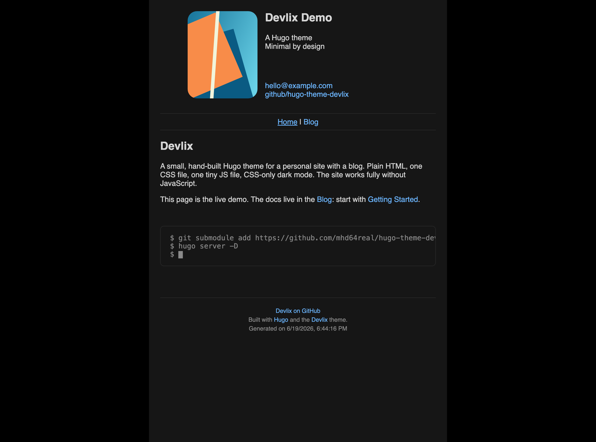

# Devlix

A small [Hugo](https://gohugo.io) theme for a personal site with a blog. Plain HTML, one CSS file, one tiny JS file, CSS-only dark mode, strong SEO defaults. The site works fully without JavaScript.

**Live demo and full docs: [demo.devlix.org](https://demo.devlix.org)**



## Features

- Profile card home page, paginated blog with RSS
- ASCII-art post header, reading time, prev/next navigation
- CSS-only dark mode (follows the system setting)
- `figure` and `terminal` shortcodes
- Optional GitHub-backed guestbook/comments (Giscus), with a no-JS fallback
- SEO out of the box: canonical, Open Graph, Twitter cards, JSON-LD, sitemap, `robots.txt`
- Responsive, and usable in terminal browsers (Lynx)

## Quick start

Requires Hugo **extended** 0.116.0+.

```bash
git submodule add https://github.com/mhd64real/hugo-theme-devlix themes/devlix
```

```toml
# hugo.toml
theme    = 'devlix'
uglyURLs = true

[params.profile]
  name  = 'Your Name'
  photo = '/img/me.jpg'
  roles = ['What you do']

  [[params.profile.links]]
    text = 'you@example.com'
    url  = 'mailto:you@example.com'
```

```bash
hugo server -D
```

That is enough to run. For every option (config, SEO, shortcodes, content structure), read the docs at **[demo.devlix.org](https://demo.devlix.org)**. A complete starter config is in `exampleSite/config.toml`.

## License

MIT.
